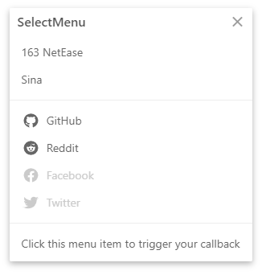
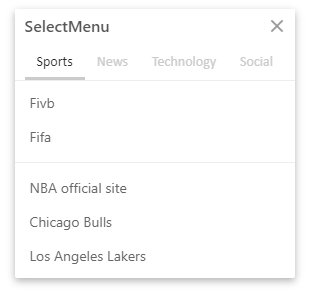
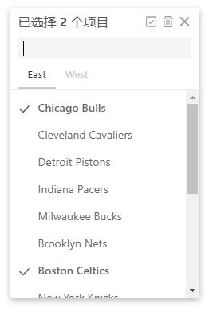

# [@therunninghub/vue-select-menu](https://opensource.therunninghub.net/projects/vue-select-menu/) [](https://www.npmjs.com/package/@therunninghub/vue-select-menu) [](https://www.npmjs.com/package/@therunninghub/vue-select-menu) [](https://standardjs.com)

Select menu for Vue.JS, A simple, easier and highly customized menu solution. This package is forked from the original package [v-selectmenu](https://github.com/TerryZ/v-selectmenu/) by [Terry Zeng](https://github.com/TerryZ).

## Examples and Documentation

Live Examples and documentation please visit below

- [Documentation](https://opensource.therunninghub.net/projects/vue-select-menu/)


## Features

- i18n support.
- regular menu multiple level support.
- multiple group type support.
- advanced menu mode with quick search.
- keyboard to quick navigate in advanced menu mode.
- custom row content render.
- embedded to page.
- mouse right click (context menu) or mouse move to call menu.

## Screenshots

*regular menu*



*regular menu with group type*



*advanced menu with group type*




## Getting Started

``` bash
npm i @therunninghub/vue-select-menu --save
```
or

``` bash
yarn add @therunninghub/vue-select-menu
```

### Register as global component

**Vue**

Include plugin in your `main.js` file.

```js
import Vue from 'vue'
import VueSelectMenu from '@therunninghub/vue-select-menu'

Vue.use(VueSelectMenu, {
  // global config options...
});
```

**Nuxt**

- Create `plugins/vue-select-menu.client.js`

```js
import Vue from 'vue'
import VueSelectMenu from '@therunninghub/vue-select-menu'

Vue.use(VueSelectMenu, {
  // global config options...
});
```

- Add config to keys `plugins` in `nuxt.config.js`

```js
module.exports = {
  // other configs
  plugins: [
    // other plugins
    // Newer Nuxt version
    src: '~/plugins/joy-vue.client.js'
    // Older Nuxt version
    { src: '~/plugins/joy-vue.client.js', ssr: false }
  ]
}
```

### Use as local component

```js
<template>
  <vue-select-menu ... />
</template>

<script>
import { VueSelectMenu } from '@therunninghub/vue-select-menu';

export default {
  components: { VueSelectMenu }
  // other code.
}
</script>

// other code
```

## License

[](https://mit-license.org/)

